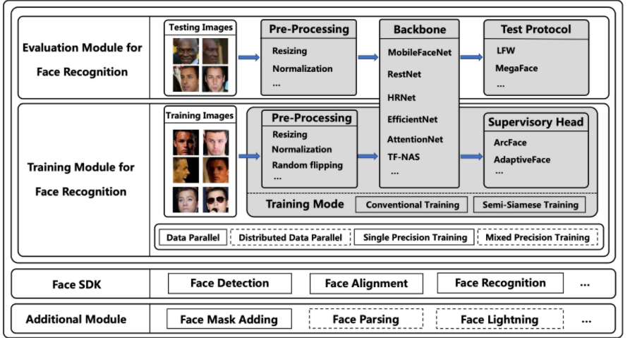
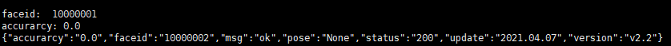
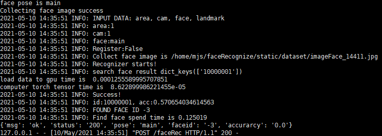

# 基于京东AI实现的人脸识别系统
## 项目简介
本项目基于京东AI的人脸识别框架工具集[FaceX-Zoo](https://github.com/JDAI-CV/FaceX-Zoo.git)所实现的人脸识别系统项目。

本项目以ArcFace为基本模型，采用半孪生训练法(SSL)。能够实现在现实场景下高质量的人脸检测-人脸识别的端到端系统。主要功能有：
- 修改完配置即可完成项目安装
- 本项目核心功能分为人脸信息注册和人脸查找两个部分
- 本项目提供了人脸信息注册和人脸识别的样例脚本，分别是restoreData.py和demo.py
- 本项目提供一键启动、一键关闭和一键出厂化设置

### 优势介绍
- 本项目是采用python的flask框架实现的人脸识别接口，具有较强的容错性能
- 本项目运行版本为GPU版，能够较为快速的建模和查找(通常为500ms以内)
- 本项目使用京东AI的人脸识别框架工具集[FaceX-Zoo](https://github.com/JDAI-CV/FaceX-Zoo.git)，其速度和性能都比较优异
- 本项目使用方式简单，部署完毕后，只需要按照提供的样例脚本传入所需图片即可得到答案
- 本项目具有一键验证功能，其比较对象为旷世的人脸验证API

### SSL介绍
Semi-Siamese Training for Shallow Face Learning

作者：Hang Du, Hailin Shi, Yuchi Liu, Jun Wang, Zhen Lei, Dan Zeng, Tao Mei

单位：上海大学;京东AI；中科院自动化研究所

论文：https://arxiv.org/abs/2007.08398

代码：https://github.com/dituu/Semi-Siamese-Training

会议：ECCV 2020 Spotlight

### FaceX-Zoo介绍
FaceX-Zoo is a PyTorch toolbox for face recognition. It provides a training module with various supervisory heads and backbones towards state-of-the-art face recognition, as well as a standardized evaluation module which enables to evaluate the models in most of the popular benchmarks just by editing a simple configuration. Also, a simple yet fully functional face SDK is provided for the validation and primary application of the trained models. Rather than including as many as possible of the prior techniques, we enable FaceX-Zoo to easilyupgrade and extend along with the development of face related domains. Please refer to the technical report for more detailed information about this project.

About the name:

"Face" - this repo is mainly for face recognition.
"X" - we also aim to provide something beyond face recognition, e.g. face parsing, face lightning.
"Zoo" - there include a lot of algorithms and models in this repo. image

代码：https://github.com/JDAI-CV/FaceX-Zoo.git

论文：https://arxiv.org/pdf/2101.04407.pdf

## 使用指南
1.克隆本项目到本地
```shell

```
2.安装相应的python依赖
```shell
切换到虚拟环境
cd FaceRecognize
pip install -r requirements.txt
```
3.安装并启动mysql：mysql可以不要求root权限

4.修改配置文件
```shell
cd FaceRecognize/config
vim config.yaml
    1.配置mysql信息
    2.选择启动模式
    3.填写旷世人脸识别API的信息
```

5.修改启动信息
```shell
vim FaceRecognize/controll.sh
host= '0.0.0.0' # 接口启动的主机地址
port=10091 # 接口启动端口

user=apps # 用户名
mysql_path=/home/$user/mysql # mysql的存放路径
```

6.启动接口
```shell
cd FaceRecognize
sh controll.sh start 
```
## 结果演示
1.注册
```shell
修改restoreData.py中的图片路径
python restoreData.py
```


2.识别
```shell
修改demo中的图片路径
python demo.py
```


## 指令介绍
| 所属文件 | 指令 | 作用|
| ------ | ----- | -----|
| controll | start | 启动系统|
| controll | stop | 终止系统|
| controll | init | 系统初始化|
| validate| |验证识别结果|
**注意：** 
- 系统初始化会清空数据库、存储的人脸库等重要数据。
- 验证识别的结果只能是前一天到前第9天的数据，暂不支持实时验证，验证结果和过程分别存储在validateResult.txt和runningLog.txt中。